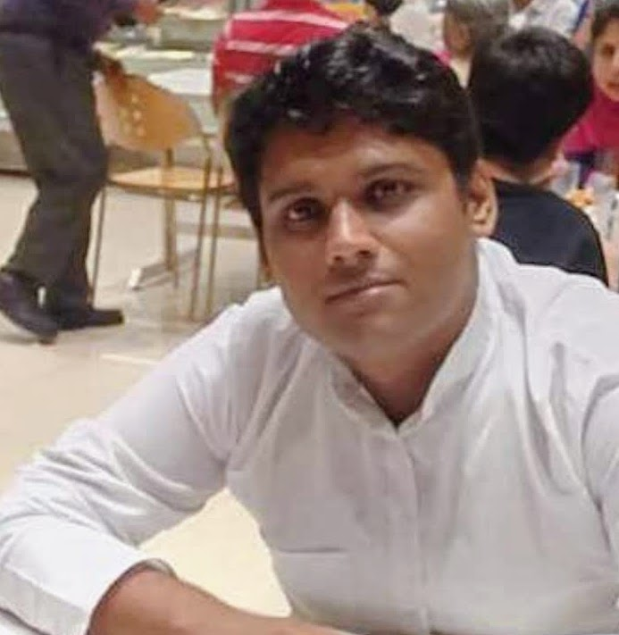

#### Gaurav Bhardwaj

## Welcome to my Research World!

Hello Everyone. I am a researcher currently working in Computer Science and Engineering Department under the supervision of [Prof. R. Balasubramanian](https://balarsgroup.github.io/) and [Prof. N. Sukavanam](https://www.iitr.ac.in/departments/MA/pages/People+Faculty+Sukavanam_N_.html) at Indian Institute of Technology, Roorkee.
### Research Areas
1. Biped Robots
2. Artificial Neural Networks
3. Computational Geometry
4. Robot Control
5. Artificial Intelligence

### Contact Details
Email: grv09bh@gmail.com, gbhardwaj@cs.iitr.ac.in
Mobile No: 9654256896

### Research Publications
1. Gaurav Bhardwaj, N. Sukavanam, Ruchi Panwar and R. Balasubramanian, "An Unsupervised Neural Network Approach for Inverse Kinematics
Solution of Manipulator following Kalman Filter based Trajectory", IEEE Conference on Information and Communication Technology(CICT) [accepted], December'19

